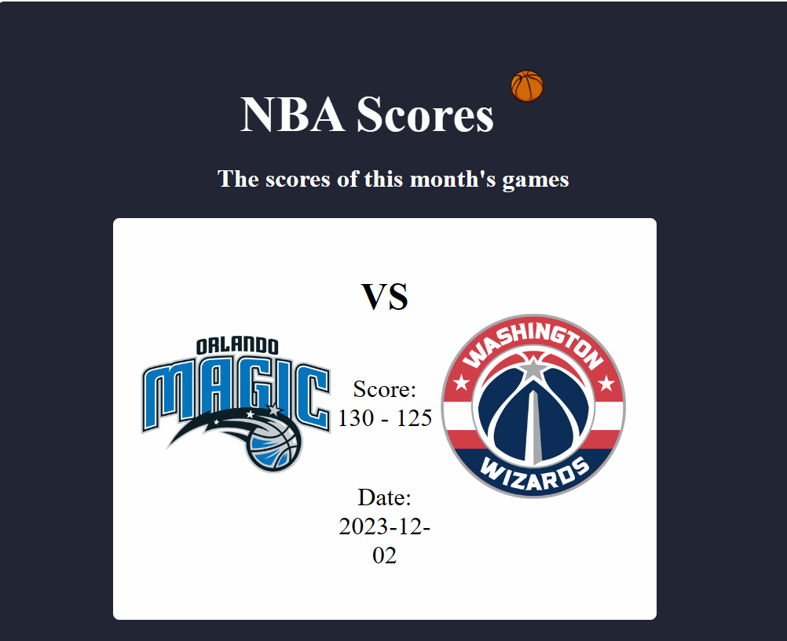
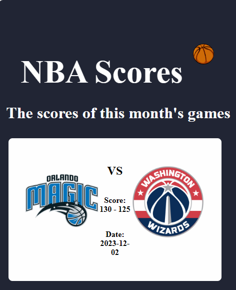

# NBA Scores Web App
This is a web application built with Node.js and Express that fetches and displays real-time NBA scores using the RapidAPI service. The scores are dynamically updated, showcasing the most recent games played in the last month.

## Main Features

1. **Responsive Design:**
   - The web app is built with a responsive design, allowing users to access and enjoy the NBA scores from any device comfortably.

2. **API Integration:**
   - Utilizes the RapidAPI service to access NBA scores, leveraging a reliable source for up-to-date sports information.

## Setup

1. **Clone the Repository:**
   ```
   git clone https://github.com/omertzroya/NBA-Scores-FullStack-Project.git
   ```

2. **Install Dependencies:**
   ```
   cd //Your current path 
   npm install
   ```

3. **Run the Application:**
   ```
   node index.js
   ```

   The server will start on [http://localhost:3000](http://localhost:3000).

## API Key Setup

To successfully run the application, you need to obtain a RapidAPI key as it is used to access the NBA scores API. Follow these steps:

1. Visit [RapidAPI](https://rapidapi.com/) and create an account.
2. Subscribe to the [NBA Odds API](https://rapidapi.com/theoddsapi/api/live-sports-odds) to get your API key.
3. Replace the placeholder `'YOUR-RAPIDAPI-KEY'` in the `X-RapidAPI-Key` header with your actual API key in the `app.get` route in `app.js`.

## Technology Used
<div>
  
  
  
  
  
  
  
</div>


## Dependencies
- Express: Web framework for Node.js
- Axios: HTTP client for making API requests
- EJS: Embedded JavaScript templating for rendering dynamic content

## Screenshots
<div style="display: flex; justify-content: space-between;">
    <div style="flex: 1; text-align: center;">
        
       
       
</div>


## Contributing

Feel free to contribute to the project by opening issues or creating pull requests. 

## License


---

Enjoy exploring NBA scores with this web app! If you have any issues or suggestions, please open an issue in the GitHub repository.


